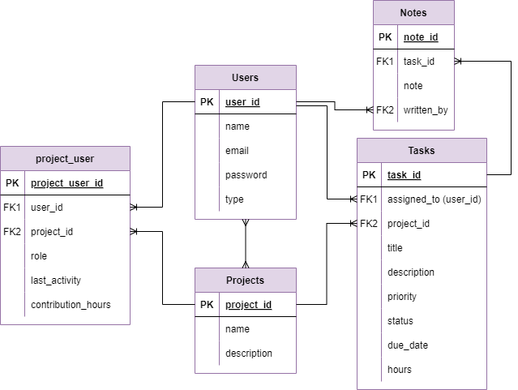

# Team Project Management System

## Description
This project is a **Team Project Management System** built with **Laravel 10** that provides a **RESTful API** for managing tasks and users. It allows users and administrators to perform various operations related to projects, tasks, and user interactions. The system follows the **Fat Models, Skinny Controllers** approach, emphasizing **separation of concerns**, **clean code principles**, and **best practices** for maintainability and scalability.

### Key Features:
- **Admin Operations**:
Has all permissions in the system.

- **User Operations**:
  - **Registration**: Users can register an account.
  - **Login/Logout**: Users can log in and out of their accounts.
  - **Change Task Status**: Users can change the status of tasks assigned to them and they have developer role.
  - **Add notes**: Users can add notes to tasks assigned to them and they have tester role.


### Key Principles:
- **Separation of Concerns**: Business logic is moved to models and service classes to ensure that controllers remain lean.
- **Clean Code**: The project adheres to clean code principles.
- **Services**: Business logic is encapsulated in service classes to promote reusability and maintainability.
- **Form Requests**: Validation is handled by custom form request classes, ensuring data integrity and business logic separation.
- **API Response Service**: Unified responses for API endpoints are managed through a dedicated service, ensuring consistency and clarity in API responses.
- **Pagination**: Results are paginated to improve performance and user experience.
- **Resources**: API responses are formatted using Laravel resources to maintain a consistent structure.
- **Seeders**: The database is populated with initial data for testing and development purposes.

### Technologies Used:
- **Laravel 10**
- **PHP**
- **MySQL**
- **XAMPP** 
- **Composer** 
- **Postman Collection**: Contains all API requests for easy testing and interaction with the API.

---

## ERD



## Installation

### Prerequisites

Ensure you have the following installed on your machine:
- **XAMPP**: For running MySQL and Apache servers locally.
- **Composer**: For PHP dependency management.
- **PHP**: Required for running Laravel.
- **MySQL**: Database for the project.
- **Postman**: Required for testing the requests.

### Steps to Run the Project

1. Clone the Repository  
   ```bash
   git clone https://github.com/TukaHeba/Team_Project_System.git
2. Navigate to the Project Directory
   ```bash
   cd Team_Project
3. Install Dependencies
   ```bash
   composer install
4. Create Environment File
   ```bash
   cp .env.example .env   
5. Generate Application Key
    ```bash
    php artisan key:generate
6. Run Migrations
    ```bash
    php artisan migrate
7. Seed the Database
    ```bash
    php artisan db:seed
8. Run the Application
    ```bash
    php artisan serve
9. Interact with the API and test the various endpoints via Postman collection 
    Get the collection from here: https://documenter.getpostman.com/view/34424205/2sAXqqchhA
